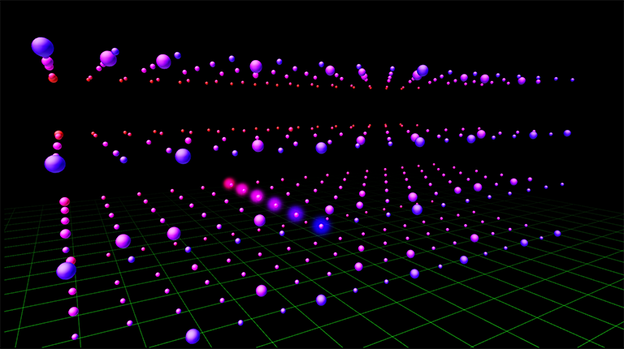

3D Sequencer
====
3Dのシーケンサーです。  
横方向が時間、奥行きが楽器、高さがシーンを表します。
Web Music Hackathon #5で作ったものです。

## Live Demo
http://aikelab.net/3dseq  
※重いです！

## Movie
https://www.youtube.com/watch?v=M5l1q8jTTBA

## キーアサイン
[SPACE]　スタート・停止  
[ESC]　ストップ  
[1][2][3][4][5][6][7][8]　楽器のON/OFF  
[Z][X][C][V]　シーンの切り替え  
[A]　全シーン表示  
[S]　選択されたシーンのみ表示

## WEBSITE
http://github.com/aike/3dseq

## CREDIT
3dseq program is licenced under MIT License.  
Contact: twitter @aike1000
